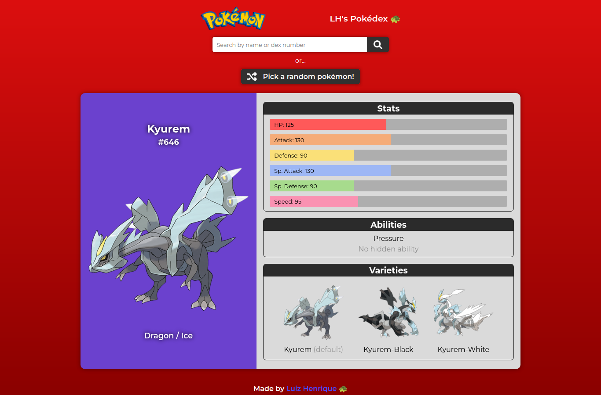

# Pokedéx 
A pokédex using the PokéAPI and plain JavaScript.

## Table of contents

- [Overview](#overview)
  - [The project](#the-project)
  - [Screenshot](#screenshot)
  - [Links](#links)
- [Process](#process)
  - [Built with](#built-with)
- [Author](#author)

## Overview

### The project

The site requests the info from the PokéAPI with the name/ID of the pokémon in the input. It shows its name, ID, artwork, types, stats, abilities and form varieties.

### Screenshot

### Links

- [Live Site URL](https://pokedex-luizhf42.vercel.app/)

## Process

### Built with

- HTML5
- CSS3
- JavaScript
- Axios
- Mobile-first workflow
- Babel
- Webpack

## Author

- Luiz Henrique Felix. 🐢

